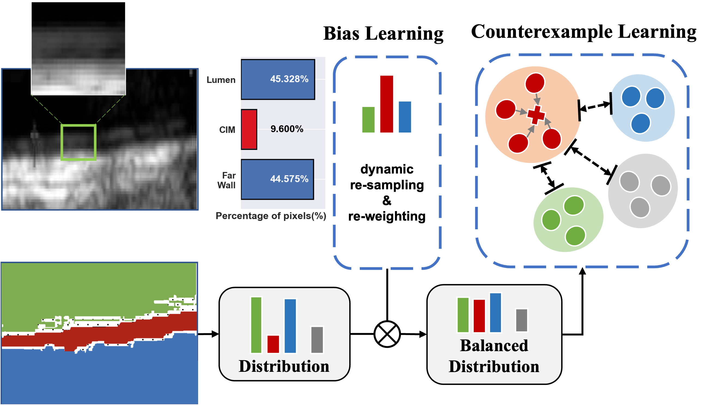
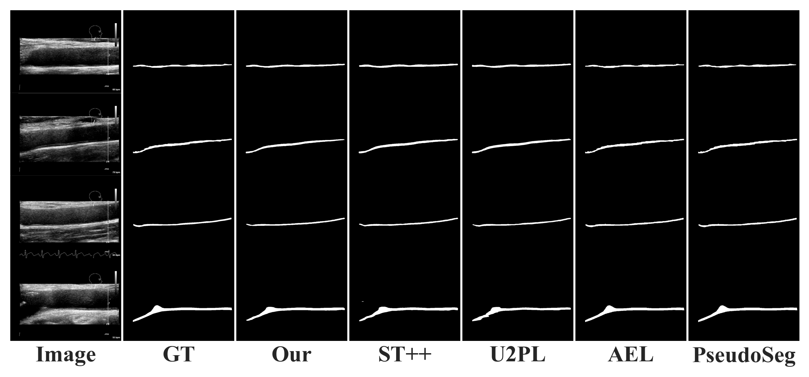
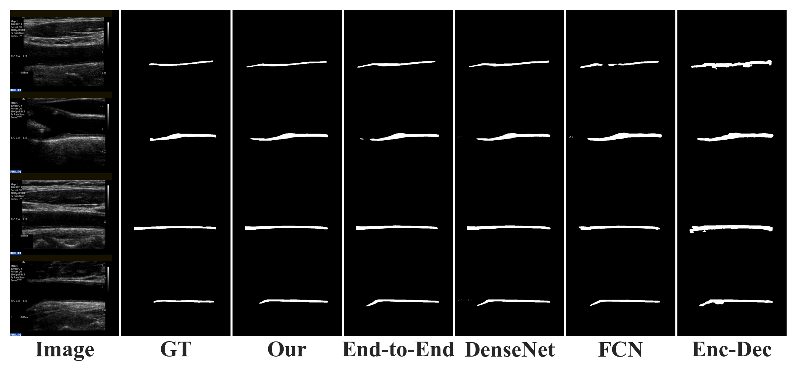

## Bias and Counterexample: Efficiently Utilized Pseudo Label for Semi-supervised Carotid Intima- Media Segmentation


### Background

---

Carotid intima-media (CIM) pixel labeling is time-intensive and demands significant expertise. The tiny proportion of intima-media layer pixels in B-mode carotid images brings class imbalance problem. Moreover, the vague CIM boundary results in unreliable pseudo labels in traditional semi-supervised learning methods.


### Method

---

We propose a novel semi-supervised learning method called Bias and Counterexample Learning (BCL) to address the above issues. Bias Learning balance the distribution of CIM pixels and Counterexample Learning efficiently utilize unreliable pueudo labels to better lower annotation requirements.




### Results

---

Our model surpasses the supervised baseline with +12.21% under 1/32 partition protocol on the public CUBS dataset and outperforms other state-of-the-art methods. 

The effectiveness of our approach is demonstrated through extensive experiments on both a public and a private dataset, indicating its robustness and potential in real-world clinical applications.






### Requirements

---


```
Pytorch
```


### Others

---

The code implementation and detailed usage will be added in the future.
